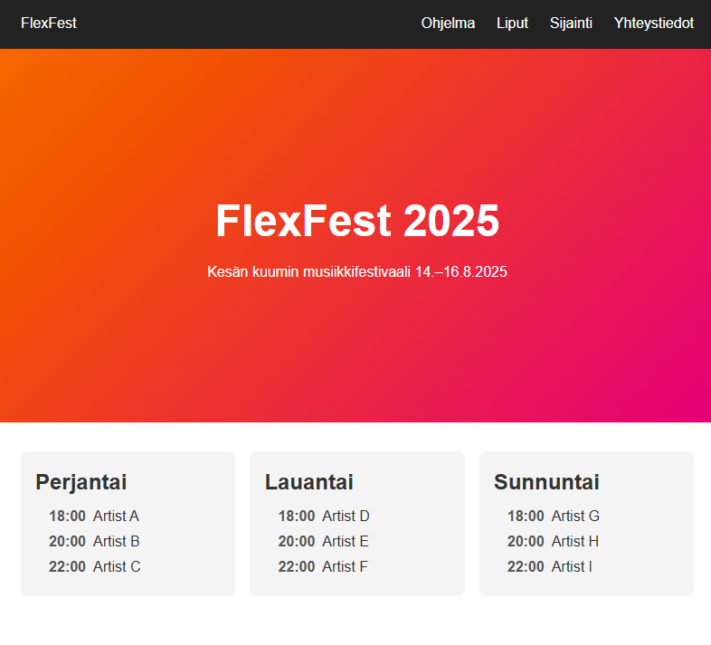
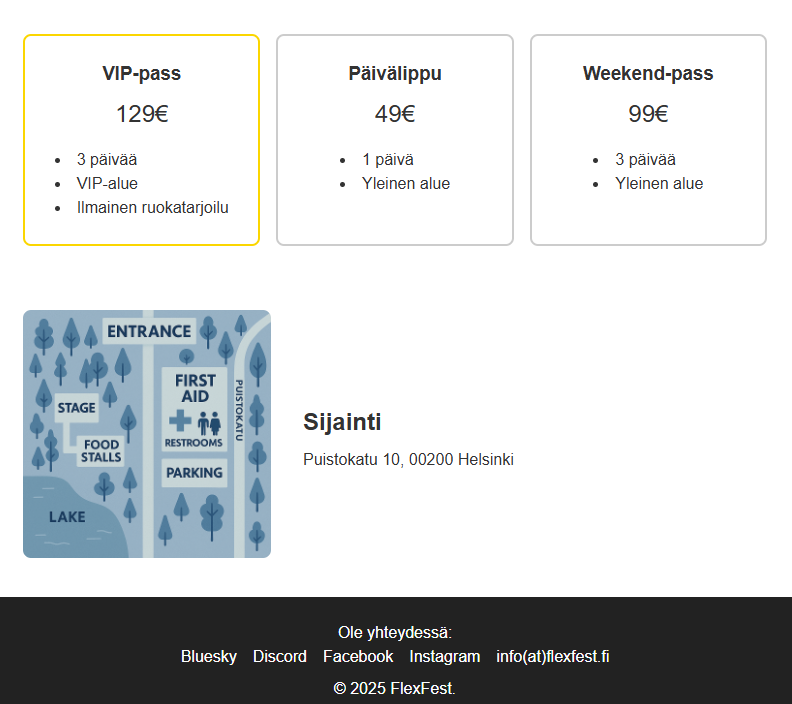

# FlexFest - harjoitus

Tässä tehtävässä harjoittelet Flexboxin käyttöä. Siihen ei kuulu lainkaan JavaScriptiä. HTML on jo valmiina, tarvitset vain CSS määrittelyitä.

## Tehtävän esittely

Toteuta sivu mahdollisimman lähelle esimerkkiä. **Muista, että tässä on tarkoitus harjoitella flexboxin käyttöä.** Keskitytään vain desktop-näkymään, mutta voit ottaa myös mobiilinäkymän huomioon.

- Tästä kansiosta löydät html-tiedoston, jossa on alla olevan sivun runko.
- Kansiossa on myös kartan kuva.
- CSS-tiedostossa on valmiiksi muut määrittelyitä, jotka eivät liity flexboxiin.
- CSS on kommenttina `/* Flexbox-määrittelyt poistettu */` niillä kohdilla, joihin niitä pitäisi lisätä.
- Jos haluat haastaa itseäsi, voit lähteä toteuttamaan CSS kokonaan itse.
- HTML-sisältöä **saa** muokata, mutta sitä **ei tarvitse muokata**, jotta tehtävä onnistuu.

_HUOM! En saanut sivua tulostettua kokonaan, siksi sivu on kahdessa kuvassa_

